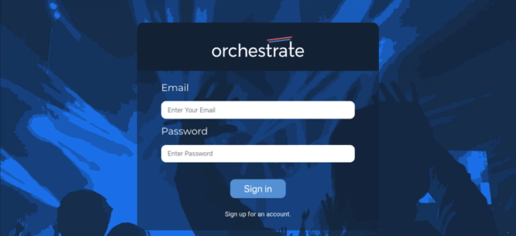

# Orchestrate

## Description

Orchestrate is a MERN stack application designed specifically for artist managers/agents (or artists) that makes many everyday tasks easier -all in a single place -your dashboard.

## Live

-   [Orchestrate](https://orchestrateapp.herokuapp.com/)
- user: admin@admin.com 
- password: 123456

## Technologies Used

-   React
-   NodeJS
-   Express
-   PassportJS
-   Bcrypt
-   JSONWebToken
-   MomentJS
-   Songkick API
-   Bandsintown API
-   SCSS

-   Used React Hooks/Context API

### Database

-   MongoDb
-   Mongoose
-   mLab

### Deployment

-   Heroku

---

## License & Copyright

© MIT
